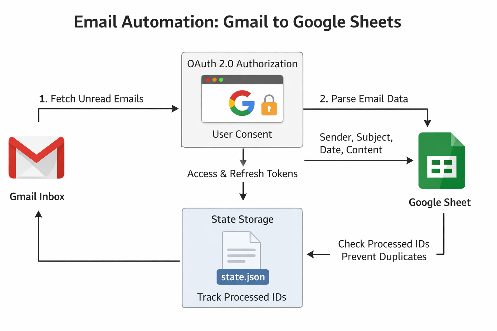

# Gmail to Google Sheets Automation

**Author:** Atharva Kale

---

## Project Overview

This project is a Python automation system that reads unread emails from Gmail
and logs them into Google Sheets using official Google APIs.

---

## Objective

Each qualifying email is added as a new row in Google Sheets with the following fields:

| Column | Description |
|------|------------|
| From | Sender email address |
| Subject | Email subject |
| Date | Date and time received |
| Content | Email body (plain text) |

---

## Project Structure
gmail-to-sheets/
├── src/
│   ├── gmail_service.py
│   ├── sheets_service.py
│   ├── email_parser.py
│   └── main.py
├── proof/
├── config.py
├── requirements.txt
├── README.md
└── .gitignore

---

## Architecture Diagram



---

## Step-by-Step Setup Instructions

### Prerequisites

- Python 3.9 or higher
- Google account
- Google Cloud Project
- Gmail API enabled
- Google Sheets API enabled

1️⃣ Install Python
	•	Install Python 3.9 or higher
	•	Verify installation:
	    python --version
2️⃣ Clone the Repository
    git clone <your-repository-url>
    cd gmail-to-sheets
	
3️⃣ Create a Virtual Environment
   python3 -m venv venv
   source venv/bin/activate

4️⃣ Install Required Dependencies
Install all required Python packages using requirements.txt:
pip install -r requirements.txt

Creating a virtual environment ensures dependencies are isolated.

---

### Configure Google Cloud

1. Create a Google Cloud project.
2. Enable the following APIs:
   - Gmail API
   - Google Sheets API
3. Create an OAuth 2.0 Client ID.
   - Application type: Desktop App
4. Download `credentials.json`.
5. Place it inside:credentials/credentials.json

---

### Configure Google Sheet

- Create a Google Sheet.
- Add these headers in row 1:
- From
- Subject
- Date
- Content
- Copy the Spreadsheet ID from the URL.
- Update `config.py`.

---

## Design Explanations

### OAuth Flow Used

- Uses OAuth 2.0 Installed App Flow
- User grants permission via browser
- Tokens are stored in `token.json`
- Tokens are reused on subsequent runs
- No service accounts are used

---

### Duplicate Prevention Logic

- Each Gmail email has a unique message ID
- Message IDs are checked before processing
- Already processed emails are skipped

```python
if msg["id"] in processed:
 continue
```

State Persistence Method
	•	Processed message IDs are stored in state.json
	•	File is read at startup
	•	Updated after execution
	•	Ensures idempotent execution
	[
  "18c9f8e9d9a3b7a1",
  "18c9f8e9d9a3b7a2"
]

## Challenges Faced

### Problem: Duplicate emails on re-run
**Solution:**  
Used Gmail message IDs and persisted them in `state.json` to skip already processed emails.

---

## Limitations

- Single-user execution
- System must be powered on for cron jobs
- OAuth app is in testing mode
- Sheet grows indefinitely
- Not suitable for public multi-user use

---

## Proof of Execution

Screenshots and a demo video are available in the `proof/` folder.

> **Note:** GitHub preview may not play audio. Please download the video to hear the explanation.


